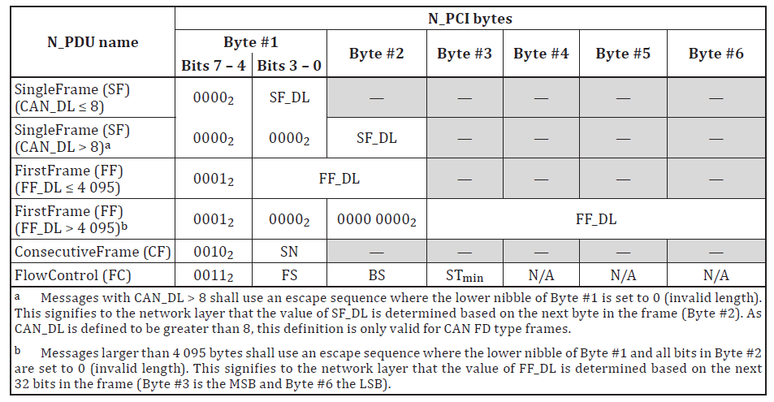
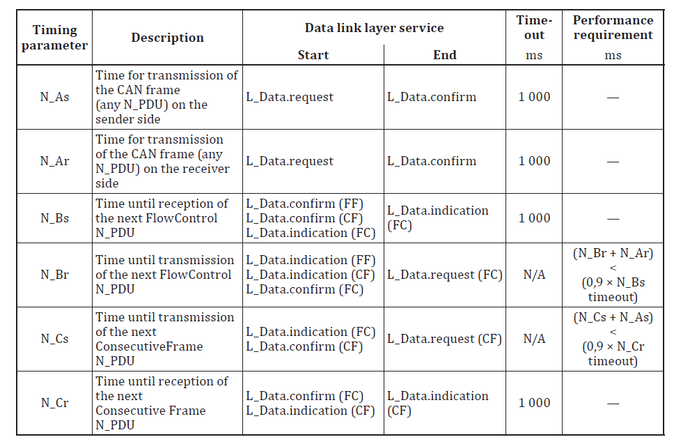
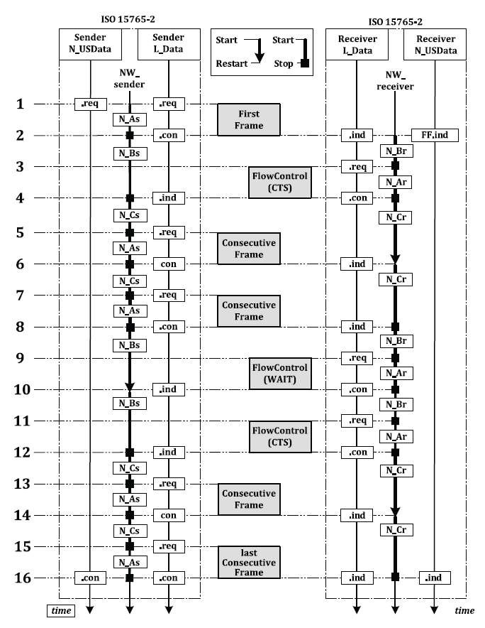

# PCI规范

四种CanTp报文类型：单帧(SingleFrame, 0x0_),首帧(FirstFrame,0x1_),连续帧(ConsecutiveFrame,0x2_)和流控帧(FlowControl, 0x3_)

## 单帧

对于CAN，Byte1的低四位是首帧中数据的长度;对于CANFD，Byte1的低四位为0，数据长度存于Byte2。

## 首帧

一般多帧的首帧中, Byte1的低四位和Byte2(共12位)共同表示多帧的总数据长度；若长度超过4095,则Byte1的低四位和Byte2都为0，用Byte3-6共同表示多帧的总数据长度。

## 连续帧

Byte1的低四位为序列号SN, SN从0x0到0xF循环递增；由于首帧占用了序列号0，首帧后的第一个连续帧的SN从1开始。后续达到0xF后再从0开始。

## 流控帧

### Flow Status(FS)

FS.CTS（0）: continue to send, 接收方已经做好准备可以接收最多BS个连续帧了。

FS.WAIT（1）：等待接收方准备好，BS和STmin在此没有意义；N_Br timer会被重启！

FS.OVFLW（2）：要求的FF_DL超出了接收方的buffer大小，只可以在收到FF后回的第一帧FC中使用。

### Block Size(BS)

接收方允许发送方接下来发送的最大连续帧数量。发送的CF在达到BS后发送方必须等待下一帧FC。BS为0代表接收方对发送方将要发送的CF不做数量限制。

### SeparationTime minimum(STmin)

发送方发送两帧连续帧的最短时间间隔。

0x00-0x7F: 0~127ms

0x80-0xF0: reserved

0xF1-0xF9: 100~900us

0xFA-0xFF: reserved

# 网络层时间参数

N_Ar, N_Br, N_Cr, N_As, N_Bs, N_Cs.

r代表接收端，s代表发送端。

A是针对所有N_Pdu的:

N_As代表发送端从开始发送到确认发送完成的时间(L_Data.request -> L_Data.Confirm)

N_Ar代表接收端从开始发送到确认发送完成的时间(L_Data.request -> L_Data.Confirm)

  -- 对于接收端，发送的诊断报文只有流控帧(FC).

B是针对FC的，

N_Bs代表发送端接收下一帧FC的时间。那么发送端什么时候开始期待下一帧FC的到来呢？

  一，首帧(FF, First Frame)发送完成后；

  二，前一帧FC中规定的BS(Block Size)所允许的最后一帧连续帧(CF, Consecutive Frame)发送完成后；

  三，收到一帧要求等待的流控帧(FC.Wait)后；

    因此，N_Bs从L_Data.confirm(FF)/L_Data.confirm(CF)/L_Data.indication(FC)开始，到L_Data.indication(FC)结束。

  N_Br代表接收端发送下一帧FC的时间。那么接收端什么时候开始准备发送下一帧FC呢？

  一，接收到FF后；

  二，接收到前一帧FC中规定的BS所允许的最后一帧CF后；

  三，确认上一帧FC.Wait发送完成后；

  因此，N_Br从L_Data.indication(FF)/L_Data.indication(CF)/L_Data.confirm(FC)开始，到L_Data.request(FC)结束。

C是针对CF的，

N_Cs代表发送端发出下一帧CF的时间。那么发送端什么时候开始准备下一帧CF的发送呢？

  一，接收到要求继续发送的流控帧(FC.CTS)后；

  二，上一帧CF发送完成后；

  因此，N_Cs从L_Data.indiction(FC)/L_Data.confirm(CF)开始，到L_Data.request(CF)结束。

  N_Cr代表接收端收到下一帧CF的时间。那么接收端什么时候开始期待下一帧CF的到来呢？

  一，发送完FC.CTS后；

  二，接收到上一帧CF后；

  因此，N_Cr从L_Data.confirm(FC)/L_Data.indication(CF)开始，到L_Data.indication(CF)结束。

从上述描述，我们可以总结出下面两条性能要求：

1. N_Br + N_Ar < 0.9 * N_Bs
    
2. N_Cs + N_As < 0.9 * N_Cr