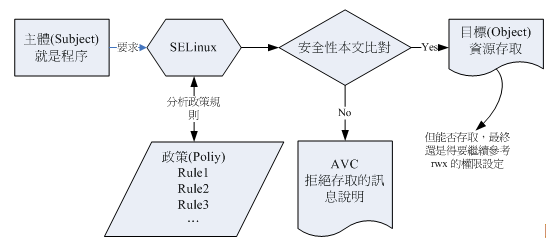

# Terms

1. 主体 Subject: SELinux主要管理的就是程序(process)
    
2. 目标 Object: 主体程序能否存取的“目标资源”一般就是文件系统。
    
3. 政策 Policy: 由于程序与文件数量庞大，SELinux会根据某些服务来制订基本的存取安全性政策，CentOS 7.x中包括：
    
    - targeted: 针对网络服务限制较多，针对本机限制较少。默认政策！
        
    - minimum: 由target修订而来，仅针对选择的程序来保护
        
    - mls: 完整的SELinux限制，较为严格。
        
4. 安全性本文 Security context: 主体要想存取目标除了政策指定之外，两者的安全性本文必须一致才行。
    

# Security Context

安全性本文存在于主体程序和目标文件资源中。

程序在内存中，因此安全性本文也存在于内存中。

文件的安全性本文是记录在文件的inode中的。