# 主线程

写一个简单的程序mycase.c

```C++
#include <stdio.h>
#include <unistd.h>

int main()
{
    int count = 0;
    prntf("main... %d\n", count++);
    sleep(1);
    
    return 0;
}
```

然后用gcc编译该程序，生成可执行文件mycase_d(debug版本)然后执行

```Bash
gcc mycase.c -o mycase_d -g
./mycase_d
```

另起一个termnial，查看mycase_d的进程号，并用gdb attach进行调试

```Bash
ps aux | grep mycase_d
sudo gdb attach [pid]
```

在gdb调试模式中，使用指令`thread apply all bt`查看所有线程的调用栈。可以看到该程序中仅有一个线程，即主线程

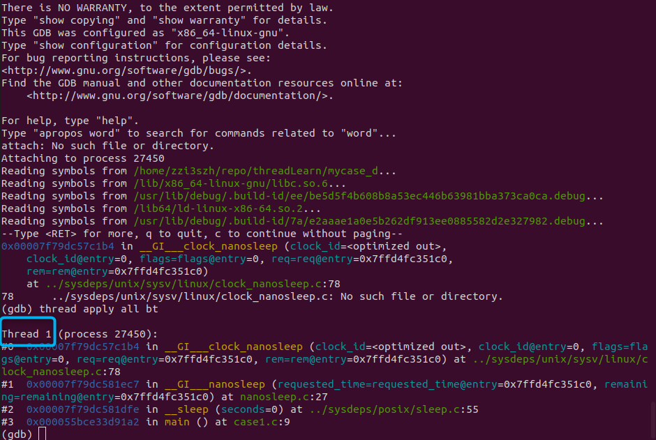

从内核角度而言，进程即线程组，线程即轻量级进程(LWP)。

因此task_struct结构体中有pid(轻量级进程号，线程号)和tgid(线程组号，进程号)。

主线程的pid和进程的tgid是相等的。

工作线程中的pid和tgid是不相等的。

# 创建线程

## pthread_create函数

```C++
NAME
    pthread_craete - create a new thread

SYNPOSIS
    #include <pthread.h>
    int pthread_create(pthread_t *thread, const pthread_attr_t *attr, 
                        void *(*start_routine)(void*), void* arg);
    
    thread: 线程标识符，线程独有地址空间的首地址
    （线程在进程地址空间的共享区中有自己独有的地址空间，保存线程调用堆栈等信息）
    attr: 线程属性，一般采用默认属性，传递NULL
    start_routine: 保存线程入口函数地址的函数指针
    arg: 给线程入口函数传递的参数
    
    Compile and link with -pthread
```

写一个主线程中创建一个工作线程的程序thread_test.c

```C++
#include <stdio.h>
#include <unistd.h>
#include <pthread.h>
#include <sys/syscall.h>

void* thread_entry(void* arg)
{
    pid_t tid = syscall(SYS_gettid);
    while(1)
    {
        printf("this is work thread %d\n", tid);
        sleep(1);
    }
}

int main()
{
    pthread_t t_addr;
    int ret = pthread_create(&t_addr, NULL, thread_entry, NULL);
    if(ret < 0)
    {
        return 0;
    }

    pid_t pid = syscall(SYS_gettid);

    while(1)
    {
        printf("This is main thread %d, thread address is %lx\n", pid, t_addr);
        sleep(1);
    }

    return 0;
}
```

使用`gcc thread_test.c -o thread_test -lpthread`命令编译生成thread_test可执行程序并执行，可以看到主线程和工作线程交替执行并打印出自己的线程pid。

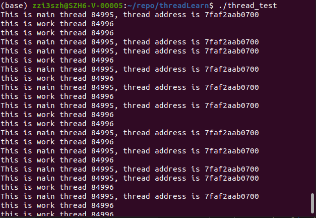

此时再次`gdb attach` thread_test进程，并执行`thread apply all bt`指令，可以看到当前进程中有两个线程，轻量级进程号LWP和打印出的线程pid相同，而工作线程打印出的线程地址同样显示在gdb打印出的信息中，即线程标识符。

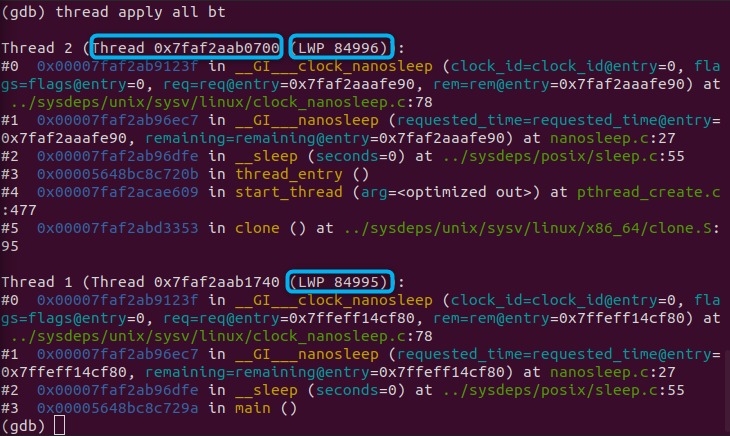

# 线程的调度

每一个线程都是独占CPU资源，进行代码的运算和执行。

1. 若两个线程运行在一个CPU上，同一时间只会有一个线程在执行，另一个线程处于等待状态。从两个线程的角度看，他们是交替执行的。此时称两个线程是**并发**执行的，每个线程都独占CPU一小会。两个线程被操作系统使用调度算法进行调度，获取到CPU。例如现在的时间片轮转，之前的先到先服务，短作业优先，优先级调度等。两个线程都是抢占式执行的，谁先执行谁后执行是说不清楚的。
    
2. 若两个线程运行在两个CPU上，主线程和工作线程各自获取一个CPU资源进行运算和执行。从线程角度看，两个线程是同时运行的，此时称之为**并行**。
    
3. 若四个线程运行在两个CPU上，那么**并行**和**并发**同时存在。同一时间两个CPU各自被一个线程抢占，另外两个线程则处于等待状态。
    

# 线程不安全

看一个多线程的例子，让我们来理解下线程不安全是怎么发生的。

```C++
#include <stdio.h>
#include <unistd.h>
#include <pthread.h>

int g_count = 1;

void* thread_entry(void* arg)
{
    if(g_count > 0)
    {
        printf("I am work thread %p, I have g_count %d\n", pthread_self(), g_count);
        g_count--;
    }
}

int main()
{
    pthread_t tid[2];
    
    for(int i = 0; i<2;i++)
    {
        int ret = pthread_create(&tid[i], NULL, thread_entry, NULL);
        if(ret<0)
        {
            return 0;
        }
    }

    while(1)
    {
        sleep(1);
        printf("I am main thread.\n");
    }

    return 0;    
}
```

上述代码中12行处的`g_count--`可分为三步, 1. 从内存中读取g_count的值到寄存器

2. 计算，将读取出的值减1
    
3. 将计算后的值从寄存器回写到内存
    

操作系统调度过程中，任何一步都有可能被打断。

**case1**:假设工作线程1在被切换前已经将`g_count--`的3步全都做完了，此时再切换到线程2,`g_count`从内存中读出的值已为0，不会进入`if`代码块。

**case2**:假设工作线程1在第3步前被打断，切换到工作线程2，那么工作线程2从内存中拿到的`g_count`值仍为1，仍然会进入10-13行中的这段逻辑。此时`--`计算发生了两次，但是结果只变了1。

## Gdb模拟

使用g++编译上述代码生成可执行文件`g++ multithread.c -o multithread -g -lpthread`

然后直接用gdb调试该程序`gdb multithread`

### Case 1

执行下列指令在代码第9行打上断点，并开始调试程序。此时查看线程信息可以看到当前处于线程2中。

```Plain
(gdb) b 9
(gdb) r
(gdb) info threads
```

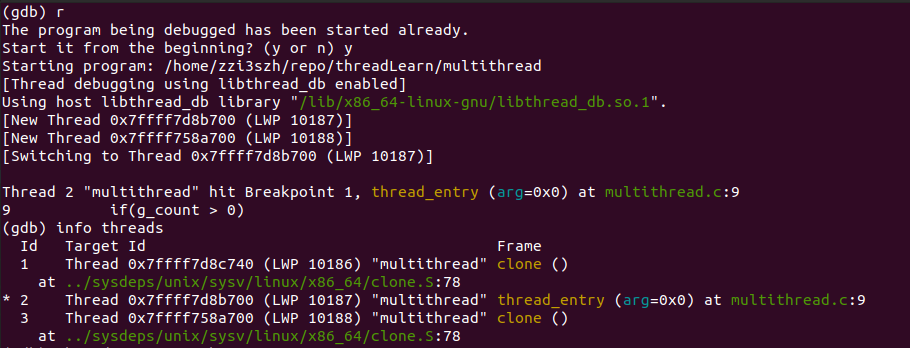

这时我们向下执行一步，可以看到程序切换到了线程3，而不是我们期待的在线程2中继续向下执行一行。这是因为gdb调试时默认调度策略是"replay"，各个线程之间的执行顺序并不确定。我们可以先切换回线程2，然后执行`set scheduler-locking on`指令，这样在线程2执行过程中，线程3不会继续执行。

此时我们打印出`g_count`，可以看到其值为1。然后再单步执行两次，可以看到程序已进入`if`代码块，打印出相应信息，将要执行`g_count--`.

```Plain
(gdb) n
(gdb) t 2    // 切换到线程2
(gdb) show scheduler-locking     // 查看当前调度策略
(gdb) set scheduler-locking on
(gdb) p g_count
(gdb) n
(gdb) n
```

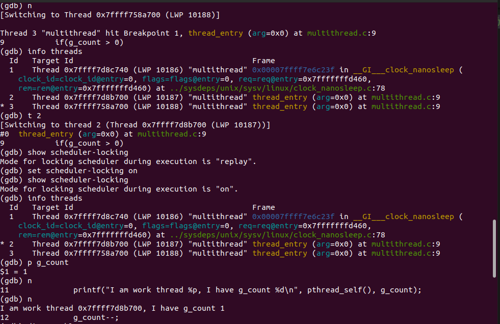

这是我们可以查看以下对应的汇编代码，图中蓝色框圈出的部分即为`g_count--`对应的汇编指令。我们通过`(gdb) ni`指令单步执行汇编指令后，可以看到`g_count`的值被存到了寄存器eax中。

```Plain
(gdb) disassemble     // 查看汇编指令
(gdb) p $eax          // 查看当前寄存器eax的值
(gdb) ni              // 单步执行汇编指令
(gdb) p $eax          // 查看当前寄存器eax的值
```

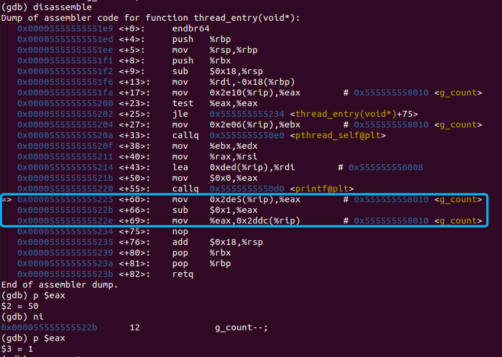

继续单步执行汇编指令，可以看到寄存器eax的值变为了0，而`g_count`的值此时仍然为1。

```Plain
(gdb) ni
(gdb) p $eax
(gdb) p g_count
```

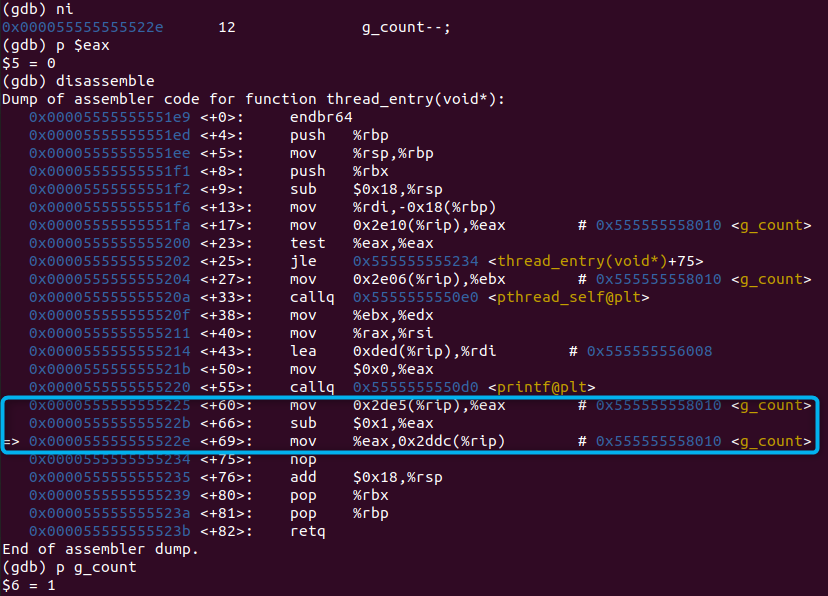

再次单步执行汇编指令后，可以看到`g_count`的值也变为了零。

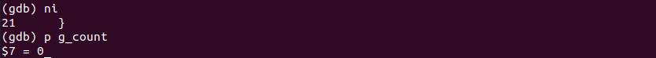

这时`g_count--`的三步已全部完成，再切换回线程3，继续执行，可以看到并不会进入`if`代码块。

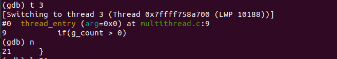

### Case 2

同样的，我们在第9行打上断点并开始执行程序，然后单步执行一次使得线程3被初始化。切换回线程2，并设置调度器锁为on。单步执行两次后停在`g_count--`前。

```Plain
(gdb) b 9
(gdb) r
(gdb) n
(gdb) t 2
(gdb) set scheduler-locking on
(gdb) n
(gdb) n
```

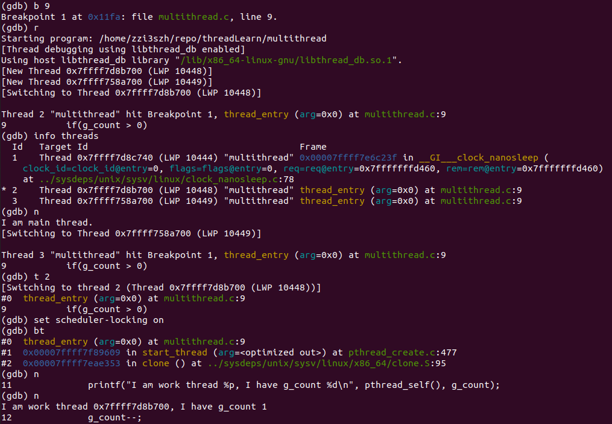

查看汇编指令，并打印`g_count`和寄存器eax的值。再单步执行汇编指令后，可以看到寄存器eax中的值变为了1。

```Plain
(gdb) disassemble
(gdb) p $eax
(gdb) ni
(gdb) p $eax
```

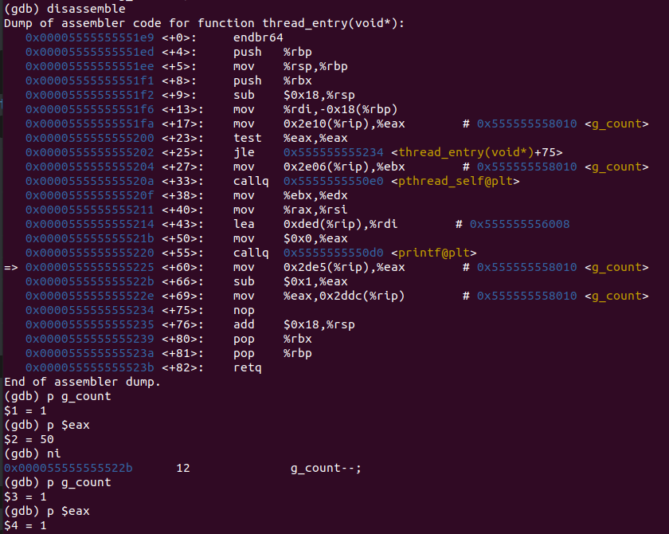

再次单步执行汇编指令后，寄存器eax中的值变为了0，而`g_count`的值仍为1。

```Plain
(gdb) ni
(gdb) p g_count
(gdb) p $eax
```

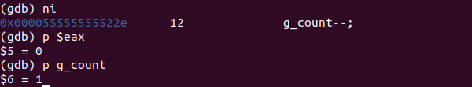

这时我们切换到线程3，可以查看到`g_count`的值仍为1。开始单步执行，可以看到程序进入了`if`代码块，最终执行了`g_count--`，将`g_count`的值改为了0。

```Plain
(gdb) t 3
(gdb) p g_count
(gdb) n
(gdb) n
(gdb) ni
(gdb) ni
(gdb) ni
```

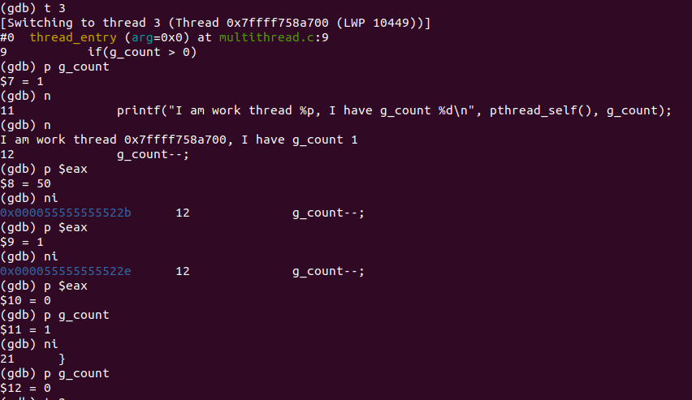

此时再切换回线程2，可以看到`g_count`的值已经被线程3改为了0。继续执行完`g_count--`的最后一步汇编指令，并打印`g_count`的值。

可以看到，`g_count--`虽然在两个线程中各执行了一次，但最终结果仍为0。

```Plain
(gdb) t 2
(gdb) p g_count
(gdb) ni
(gdb) p g_count
```

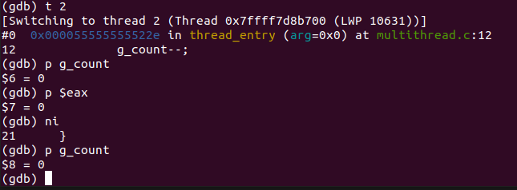