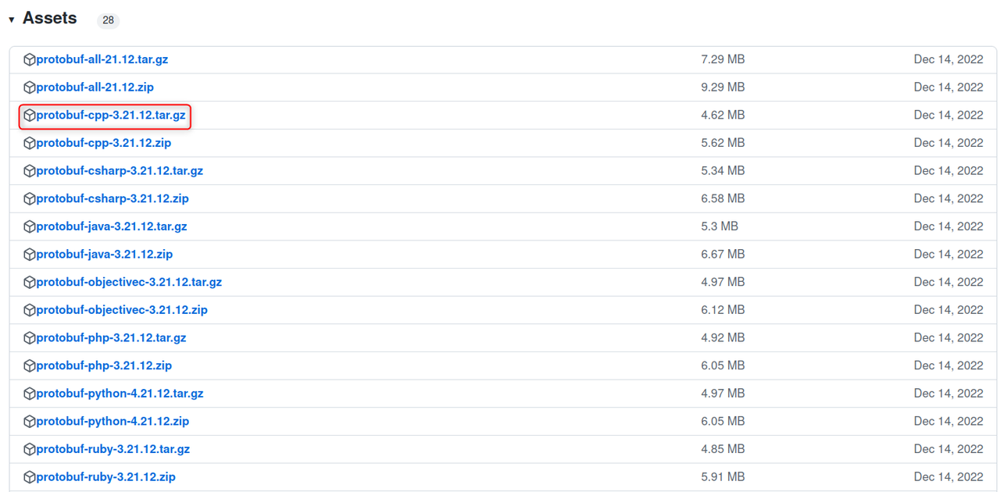
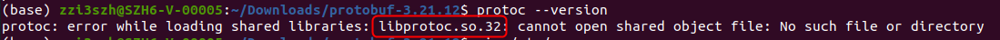
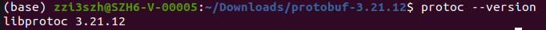

# linux

1. 当前使用的protobuf版本为3.21.12, 直接从https://github.com/protocolbuffers/protobuf/releases/tag/v21.12 下载protobuf-cpp-3.21.12.tar.gz。（若需要针对其他语言的protobuf，也可下载其他相应的tar.gz文件）
    


2. 解压后，进入相应文件夹（此时还没有Makefile文件），并执行以下指令
    

```Bash
tar zxvf protobuf-cpp-3.21.12.tar.gz
cd protobuf-cpp-3.21.12
./configure
make
sudo make install
```

1. 若无报错，可执行以下指令确认protobuf安装完成
    

```Bash
protoc --version
```

此时可能会报如下错误，需要通过`find / -name libprotoc.so.32`找到动态库所在路径后将libprotoc.so.32所在的路径添加到系统文件/etc/ld.so.conf中并执行`sudo ldconfig`（详见[[动态链接]]）



随后再次执行上述指令确认protobuf版本

