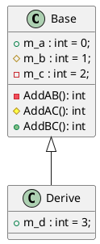
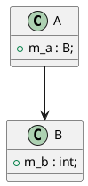
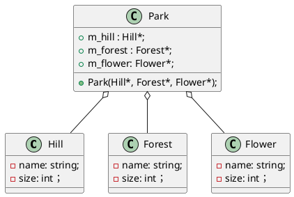
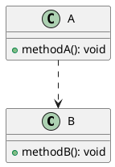
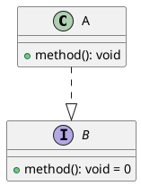

PLANTUML guideline: [Class Diagram syntax and features (plantuml.com)](https://plantuml.com/class-diagram)

# 继承关系

继承或泛化是类之间约束最强的关系。在UML类图中用空心箭头的实线表示，箭头指向父类。



# 关联关系

关联关系是类之间约束较弱的关系，通常A类中定义了B类的成员变量则称A关联了B。在UML类图中用实心箭头的实线表示。



# 聚合关系

聚合关系是类之间约束相对较弱的关系，例如公园中有假山，树林，花丛等，但假山，树林，花丛在公园不存在时也可以独立存在，他们只是聚合起来形成了公园，但这种聚合较为松散。(公园类析构时，并不会删除假山，森林，花丛对象占用的内存。如果我们能通过某种方式获取这些对象，那么他们依然可以被使用)。在UML类图中用带空心菱形箭头的实线表示。

```C++
class Park
{
public:
        Hill* m_hill;
        Forest* m_forest;
        Flower* m_flower;
        Park(Hill* f_hill, Forest* f_forest, Flower* f_flower): m_hill(f_hill), m_forest(f_forest), m_flower(f_flower) {}
        ~Park() = default;
};

class Hill
{
        string name;
        int size;
};

class Forest
{
        string name;
        int size;
};

class Flower
{
        string name;
        int size;
};
```



# 组合关系

组合关系是类之间约束相对较强的关系，例如头由眼睛、鼻子、嘴、耳朵等组成，这些部件是无法独立于“头”单独工作的。（头类析构时，应同时将眼睛鼻子嘴耳朵的内部成员变量析构）在UML类图用带实心菱形箭头的实线表示。

```C++
Class Head
{
        Eye* m_eye;
        Nose* m_nose;
        Mouth* m_mouth;
        Ear* m_ear;
        Head(Eye* f_eye, Nose* f_nose, Mouth* f_mouth, Ear* f_ear) : m_eye(f_eye), m_nose(f_nose), m_mouth(f_mouth){}
        ~Head() {
                delete m_eye;
                delete m_nose;
                delete m_mouth;
                delete m_ear;
        }
};
class Eye{
...
};
class Nose{
...
};
class Mouth{
...
};
class Ear{
...
};
```

```plantuml
class Head{
        - m_eye : Eye
        - m_nose ： Nose
        - m_mouth: Mouth
        - m_ear: Ear
}

class Eye{}
class Nose{}
class Mouth{}
class Ear{}

Head *-- Eye
Head *-- Nose
Head *-- Mouth
Head *-- Ear
```

# 依赖关系

依赖关系是类之间约束最弱的关系。当

1. A中某成员函数的参数为B类对象
    
2. A中某成员函数内使用了临时的B类对象
    
3. A中调用了B类静态方法 时，A依赖于B。在UML类图中，用虚线箭头表示。
    



# 约束强度

继承（泛化）> 组合 > 聚合 > 关联 > 依赖

_又出现了一些其他关系，嗯，咋说呢，这种分类可能并不是那么明确，能清楚表达自己的意思就行。_

# 接口实现

A类实现了B接口定义的方法，那么A就实现了B，在UML类图中用虚线+空心箭头表示，指向被实现的接口类。

